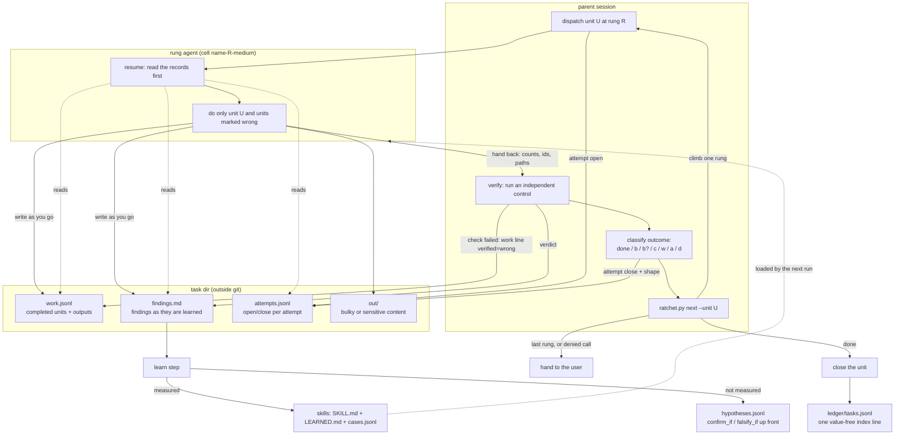

# Ratchet

Records and a retry ladder for delegated agent work, as a Claude Code plugin.

The name: work only moves forward. A verified unit is never redone, and a failed unit moves one
rung down the model ladder instead of being retried blind.

When a parent session hands a unit of work to a subagent, three things usually go missing: the
work the agent finished (it survives only in a hand-back message), what it learned on the way
(same), and why a particular model was chosen for the retry (nobody wrote it down). This
plugin gives all three a file, and turns the retry into a procedure you can measure:

- `work.jsonl` — one line per completed, reusable unit, with its outputs and the control that
  checked it;
- `findings.md` — findings written as they are learned, one section per attempt, append-only;
- `attempts.jsonl` — one open and one close line per attempt, with the rung, the model, the
  outcome class and the *shape* of the failure;
- a **model ladder** — an ordered list of rungs; a classified failure moves only the failing
  unit one rung down, and the bottom of the ladder is the user;
- one value-free **index line** per task, so a fresh session finds the task without opening
  the task dir;
- a **learn step** that turns measured findings into skills, and unmeasured ones into
  hypotheses with confirm/falsify conditions written up front.

Everything workflow-specific — the ladder, the failure classes, where task dirs live, what may
be written inline in a finding, the standing rules every dispatch repeats — comes from a
`ratchet.toml` and an adapter skill. The tool itself is stdlib-only Python 3.9+ and knows
nothing about your domain.

## How the pieces fit



Plain text, if the diagram does not render: the **parent** opens an attempt (a line in
`attempts.jsonl`), dispatches unit U to the **rung agent** for the current rung. The agent's
first act is `resume`, which reads `work.jsonl`, `findings.md` and `attempts.jsonl` and tells
it which units are already done (cite them), which are marked wrong (redo them) and what shape
of failure not to repeat. As it works it appends findings to `findings.md` and one line per
finished unit to `work.jsonl`, with outputs in `out/`; it replies with counts, ids and paths.
The parent then runs its **own control**: if it fails, the parent writes a `verified=wrong`
work line naming the line it corrects and closes the attempt as class `w`; otherwise it writes
a `verified=parent` line. Either way the attempt closes with an outcome class and a short
shape. `next` applies the ladder: `done` closes the unit, a climbing class dispatches the next
rung down with the same records in place, a denied call or the last rung hands the task to the
user. At task end one value-free line goes into `ledger/tasks.jsonl`. Finally the **learn
step** reads `findings.md`: measured lessons edit a skill (and add a `LEARNED.md` line and a
`cases.jsonl` row), unmeasured ones become hypotheses with their confirm and falsify conditions
written before the result is known — and those skills are what the next run loads.

## Install

As a local marketplace (the repo is both the marketplace and the plugin):

```
/plugin marketplace add /path/to/ratchet
/plugin install ratchet@ratchet
```

That makes three skills available: `task-records`, `model-ladder`, `skill-learning`.

Or use it without the plugin system: copy `tools/ratchet.py` into your project and the
three skill directories into `.claude/skills/`.

## Quickstart

```bash
cp templates/ratchet.toml ./ratchet.toml      # edit the ladder, climb set, task root
python tools/ratchet.py config         # check what is in effect, and from where

# per task
dir=$(python tools/ratchet.py init --repo my-workflow)
python tools/ratchet.py attempt open "$dir" --k 1 --rung opus55 --unit u1 --agent 1a2b3c4d
# the agent, as it works:
python tools/ratchet.py find "$dir" --attempt 1 --rung opus55 --agent 1a2b3c4d \
    --finding "input has 412 rows, 3 columns missing" --evidence out/u1/shape.json
python tools/ratchet.py work "$dir" --unit u1 --attempt 1 --rung opus55 \
    --output out/u1/clean.csv --method scripts/clean.py --verified self --control "row count"
# the parent, when it returns:
python tools/ratchet.py work "$dir" --unit u1 --attempt 1 --rung parent \
    --verified parent --method "independent wc -l" --control out/u1/rowcount.txt
python tools/ratchet.py attempt close "$dir" --k 1 --rung opus55 --unit u1 --outcome done
python tools/ratchet.py resume "$dir"
```

Generate one subagent per rung, so a retry is a dispatch by name:

```bash
python templates/gen_agents.py --base templates/worker.md --name my-worker \
    --agents-dir ~/.claude/agents            # --check in CI to catch stale cells
```

Then write your adapter from `templates/adapter-SKILL.md`: config path, your verification
controls, your content rules, your standing dispatch rules. `examples/demo-adapter/` is a
filled-in one for a nightly release-notes pipeline, with its own two-rung ladder and its own
failure classes.

Tests and the skill self-test:

```bash
cd tests && python -m unittest                                   # 33 tests
python skills/skill-learning/skillcheck.py skills --strict
```

## What it improves

Three concrete changes to how a multi-agent task runs:

1. **A retry costs one unit, not the whole task.** Because finished units are on disk with the
   control that verified them, the retry prompt can say "these are done, cite them; this one
   failed, and here is the shape that failed". Without the records, a stopped agent takes its
   finished work with it and the next attempt starts from zero.
2. **Model choice stops being a vibe.** The ladder is a config file, the failure is classified
   into a small fixed set, and `next` is a command. Every attempt leaves a `rung:outcome` pair,
   so after fifty tasks you can see which rung actually finishes which kind of unit — and
   whether the expensive rung was worth it.
3. **Verification is a separate, recorded step.** `verified: self` (the agent ran a control)
   and `verified: parent` (the parent ran one) are different fields, and a rejected result is a
   first-class outcome with a work line that names what it corrects. "It said it worked" is no
   longer a passing state.

## Benefits

- Resumable tasks: a fresh session reads `resume` and continues; nothing lives only in a
  session transcript.
- No silent rework: the digest lists done units with their outputs, so regeneration is a
  visible prompt bug rather than a quiet cost.
- Failures become data: classes, shapes and rungs are queryable across tasks.
- Cheap escalation path with a defined end: the bottom of the ladder is a human, not a loop.
- Findings outlive the run and feed the learn step, so skills grow from measurements that cite
  the work that taught them.
- Append-only, lock-protected JSONL with tool-assigned `n`/`ts`: concurrent writers and torn
  lines do not corrupt the history.
- Domain-free core: one tool and three skills serve several projects; each project differs only
  in its config and adapter.

## Costs and downsides, honestly

- **Parent bookkeeping per attempt.** Two attempt lines, a verification work line, a
  verification finding, and a `next` call for every attempt. On a one-unit, one-shot task this
  is pure overhead; it pays off from roughly the second attempt or the second session onward.
- **Retries cost tokens on several models.** A unit that climbs four rungs has been attempted
  four times, each time re-reading the records. If a unit fails for a reason that is not the
  model — a missing input, a wrong instruction — the ladder will happily spend all seven rungs
  discovering that. The "two rungs, same shape, stop" rule exists for this, and it depends on
  the parent actually applying it.
- **Lower rungs are weaker.** Climbing trades capability for a different attempt. Results from
  lower rungs need the parent's control more, not less, and `w` outcomes concentrate there.
  Without real controls the ladder quietly converts "stopped" into "wrong but recorded".
- **Model ids go stale.** The ladder is a hardcoded list of ids in a config file. When a model
  is retired, every project's `ratchet.toml` needs an edit, and old records refer to rungs that
  no longer exist. `unavailable` as a climb outcome softens this; it does not remove the
  maintenance.
- **Config drift between projects.** Two projects with different rung labels, different climb
  sets and different adapters cannot have their numbers compared directly. Shared measurement
  needs shared labels, which is a convention nobody enforces for you.
- **The records are only as good as the agents' discipline.** "Write as you go" is an
  instruction, not a mechanism. An agent that batches its findings into the final message and
  is then stopped leaves nothing behind — exactly the case the plugin exists for. Generated
  rung cells and a short standing-rules block help; they do not guarantee it.
- **Sensitive content can leak into the records.** `findings.md` is plain text in a scratch
  dir. The default header and the `[findings] note` push bulk and secrets into `out/`, but if
  the adapter's content rules are vague, an agent will write a credential into a finding and
  nothing will stop it. Write that section of the adapter first, and keep task dirs out of git.
- **Another layer to learn.** A contributor now has to know what a unit, a rung, a class and a
  shape are before they can read a task dir. Small tasks are often better off without it.

## Layout

```
tools/ratchet.py            the helper: init, work, find, attempt, resume, next, index, config
tests/test_ratchet.py       unittest suite, stdlib only
skills/task-records/             the records: what to write, when, and the formats
skills/model-ladder/             classes, climbing, the retry prompt, when to stop
skills/skill-learning/           the learn step, plus skillcheck.py (structural self-test)
templates/ratchet.toml            every config key, documented
templates/worker.md              generic rung-agent base
templates/gen_agents.py          generate one cell per rung from the config's ladder
templates/adapter-SKILL.md       what a consuming workflow fills in
examples/demo-adapter/           a filled adapter + ratchet.toml for a release-notes pipeline
.claude-plugin/                  plugin.json and marketplace.json
```

## Adopting it in an existing workflow

Keep your own skills and task dirs. Install this plugin, write a `ratchet.toml` with your ladder
and task root, and move everything domain-specific into one adapter skill per project, written
from `templates/adapter-SKILL.md`:
- where task dirs live;
- what may appear in a finding;
- what counts as a verified result;
- the standing rules every dispatch repeats.

If you already keep similar records, keep the rung labels stable so old and new measurements
stay comparable.
